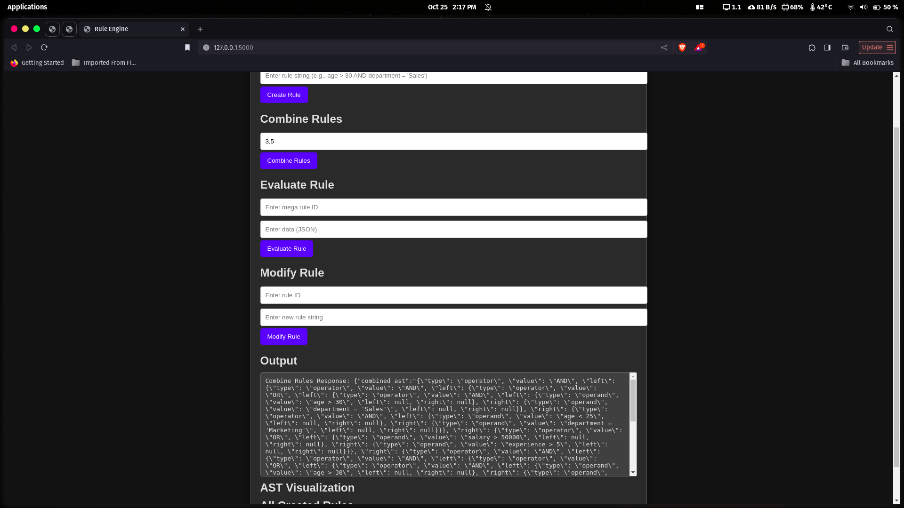

# Rule Engine Application

This project is a rule engine application developed in Flask, with an interactive frontend to create, combine, evaluate, and modify logical rules. It uses SQLAlchemy for data persistence with SQLite and D3.js for visualizing Abstract Syntax Trees (ASTs). This application allows users to define conditional rules, store them in a database, combine rules logically, evaluate rules based on given data, and modify existing rules.

## Table of Contents
- [Features](#features)
- [Technologies Used](#technologies-used)
- [Installation](#installation)
- [Database Schema](#database-schema)
- [Endpoints](#endpoints)
- [Frontend Interface](#frontend-interface)
- [Usage Instructions](#usage-instructions)
- [Screenshots](#screenshots)
- [Future Enhancements](#future-enhancements)

---

## Features

| Feature                        | Available ✅ |
|--------------------------------|--------------|
| Create Rule                    | ✅           |
| Combine Multiple Rules         | ✅           |
| Evaluate Rule with JSON Data   | ✅           |
| Modify Existing Rules          | ✅           |
| Database Storage for Rules     | ✅           |
| Rule Evaluation Logging        | ✅           |
| Frontend UI for Rule Operations| ✅           |
| AST Visualization              | ✅           |
| API Endpoints for Each Feature | ✅           |


## Features

- **Create Rules**: Define rules using logical expressions (e.g., `age > 30 AND department = 'Sales'`).
- **Combine Rules**: Combine existing rules with `AND` or `OR` operators to create complex logical structures.
- **Evaluate Rules**: Evaluate rules based on JSON input data and return whether the data meets the rule conditions.
- **Modify Rules**: Update existing rules with new logic expressions.
- **AST Visualization**: Visualize the abstract syntax tree (AST) of each rule, showcasing its logical structure.

## Technologies Used

- **Flask**: Backend framework to handle HTTP requests and responses.
- **SQLAlchemy**: ORM to handle database interactions with SQLite.
- **D3.js**: Data visualization library used to render ASTs.
- **HTML, CSS, JavaScript**: Frontend technologies to create an interactive interface.
- **Logging**: Used to track application flow and debug issues.

## Installation

To set up this application locally, follow these steps:

1. **Clone the repository**:
   ```bash
   git clone https://github.com/RAJPOWELL/Rule-Engine-with-AST.git
   cd Rule-Engine-with-AST
   ```

2. **Install dependencies**:
   Make sure Python 3.10+ and pip are installed, then:
   ```bash
   pip install -r requirements.txt
   ```

3. **Run the application**:
   Start the Flask application:
   ```bash
   python app.py
   ```

4. **Open in browser**:
   Go to `http://127.0.0.1:5000` in your browser to access the rule engine interface.

## Database Schema

The application uses a SQLite database with a single table:

- **Table Name**: `rules`
- **Columns**:
  - `id` (Integer, Primary Key): Unique identifier for each rule.
  - `rule_string` (String): The logical expression of the rule (e.g., `age > 30 AND department = 'Sales'`).
  - `ast` (Text): JSON representation of the rule's AST.

---

## Endpoints

| Endpoint          | Method | Description                          |
|-------------------|--------|--------------------------------------|
| `/create_rule`    | POST   | Creates a new rule.                 |
| `/combine_rules`  | POST   | Combines multiple rules.            |
| `/evaluate_rule`  | POST   | Evaluates a rule against JSON data. |
| `/modify_rule`    | POST   | Modifies an existing rule.          |
| `/`               | GET    | Renders the main interface.         |

Each endpoint accepts and returns JSON data as shown below:

### `/create_rule`
**Request**:
```json
{
  "rule_string": "age > 30 AND department = 'Sales'"
}
```
**Response**:
```json
{
  "id": 1,
  "ast": "{...}"  // JSON-serialized AST structure
}
```

### `/combine_rules`
**Request**:
```json
{
  "rule_ids": [1, 2]
}
```
**Response**:
```json
{
  "id": 3,
  "combined_ast": "{...}"
}
```

### `/evaluate_rule`
**Request**:
```json
{
  "rule_id": 1,
  "data": {
    "age": 35,
    "department": "Sales"
  }
}
```
**Response**:
```json
{
  "result": true
}
```

### `/modify_rule`
**Request**:
```json
{
  "rule_id": 1,
  "new_rule_string": "age > 25 AND department = 'Marketing'"
}
```
**Response**:
```json
{
  "message": "Rule updated successfully"
}
```

## Frontend Interface

The frontend interface provides forms for each functionality:
- **Create Rule**: Input a rule string and see it added to the rule list.
- **Combine Rules**: Input comma-separated rule IDs to create a combined rule.
- **Evaluate Rule**: Input a rule ID and JSON data to check if the data matches the rule.
- **Modify Rule**: Input a rule ID and new rule string to update an existing rule.

The page also includes:
- **AST Visualization**: The AST of each created rule is displayed using D3.js.
- **All Created Rules**: Lists all rules created during the session.

### `index.html`

Contains the main HTML structure and references the `styles.css` file for styling.

### `script.js`

Contains JavaScript functions for frontend functionality and the D3.js code for AST visualization.

### `styles.css`

Contains the styles for the frontend interface, including a dark theme and animated buttons.

## Usage Instructions

### Creating a Rule

1. In the "Create Rule" section, enter a rule string, such as `age > 30 AND department = 'Sales'`.
2. Click "Create Rule".
3. The new rule will appear in the "All Created Rules" section, and its AST will display under "AST Visualization".

### Combining Rules

1. In the "Combine Rules" section, enter rule IDs separated by commas (e.g., `1, 2`).
2. Click "Combine Rules" to create a new combined rule.
3. The result will be displayed, with a new combined rule ID in the "All Created Rules" section.

### Evaluating a Rule

1. In the "Evaluate Rule" section, enter the rule ID and JSON data matching the rule structure.
2. Click "Evaluate Rule" to see if the rule condition is satisfied.

### Modifying a Rule

1. In the "Modify Rule" section, enter the rule ID you want to modify.
2. Enter the new rule string and click "Modify Rule" to update it.

## Screenshots

### 1. **Rule Creation**


### 2. **Combining Rules**



### 3. **Evaluating a Rule**


### 4. **AST Visualization**


